# AEON — a living universe

An interactive, real-time universe that runs in your browser. No build step,
no assets, no network: one integer seed and ~4,000 lines of JavaScript/GLSL
unfold into a cosmos you can fall through — from the large-scale structure of
spacetime down to rain-free ocean worlds and the warped light around a
supermassive black hole.

And the integer itself is **rolled fresh every visit**: the universe you
arrive in exists for the first time when the page loads, nobody has seen it
before, and the roll is reflected straight into the URL — copy the address
bar and anyone can stand where you stood. Press **U** anywhere to roll
another one.

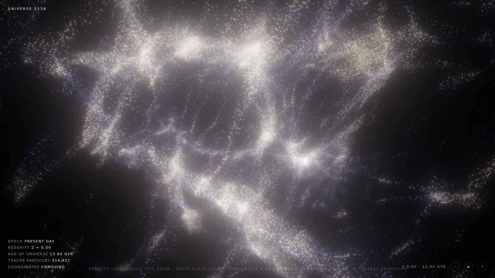

## Run it

```bash
# any static file server works; from the repo root:
python3 -m http.server 8080
# then open http://localhost:8080
```

Best experienced full-screen, in the dark, on an OLED display. The background
is true `#000` black.

Optional URL parameters: `?seed=42` (pin a universe — omit it and every
visit rolls a new one), `?n=96` (cosmic-web tracer resolution per axis,
default 68 → 314k particles), `?qk=4` (planet-quadtree quality: tile budget
vs fidelity, default 6.5), `?quad=0` (skip the streaming-planet scale, land
directly), `?ap=0` (arrive in orbit with the helm instead of the autopilot).

Your location is reflected into the URL as you travel (`?g=…&s=…`, `&bh=1`
at the nucleus, `&pl=…` on approach, `&p=…` on the ground), so any place
in any universe is a bookmarkable, shareable address.

## The six scales

You descend through nested scales — and the transitions are **seamless
hyperzooms**: the camera falls toward what you clicked, the scales swap
mid-motion under a passing snapshot, and you arrive still moving. No cuts,
no fades to black. **Click** selects, **double-click** dives, **Esc**
ascends, **Space** pauses time, **+ / −** bend it, **H** hides the
interface, **U** rolls a fresh universe, **drag / scroll** to fly. Every
control on every scale is exercised by a headless audit suite that drives
real key and pointer events through the same paths your hands do.

### 1 · The cosmic web — a real N-body simulation
262,144 dark-matter particles run through a **particle-mesh N-body code on
your GPU**: every frame their mass is deposited on a 64³ mesh, Poisson's
equation is solved in Fourier space by a Stockham FFT
(`φ_k = −3Ωm δ_k / 2ak²`, 36 shader passes), forces come from differencing
the potential, and the particles are kicked and drifted with the ΛCDM
factors `dp/da = −∇φ/(aE)`, `dx/da = p/(a³E)` — the same leapfrog scheme as
research codes, integrated from the Friedmann equation for a flat ΛCDM
universe (Ωm = 0.315, ΩΛ = 0.685, H₀ = 67.4; Planck 2018). Initial
conditions are **Zel'dovich** displacements at z ≈ 20, so structure grows
from linear theory into genuine self-gravity: filaments stay thin, halos
collapse and virialize. Press `N` to flip between the N-body run and pure
linear theory and see exactly what gravity adds after shell-crossing. `E`
switches comoving ↔ physical coordinates; the HUD reads out true redshift
and cosmic age. (No float-render support? It falls back to the analytic
Zel'dovich field automatically.)

### 2 · Galaxy
About one disk galaxy in six is caught **mid-collision**: the two cores
move as an exact two-body problem while 262,144 disk stars ride along as
test particles in the moving potentials — the restricted three-body scheme
with which Toomre & Toomre first explained the Antennae in 1972, integrated
live on the GPU. Watch the first passage pour a bridge of stars toward the
companion while counter-tails sling outward; nothing is keyframed.

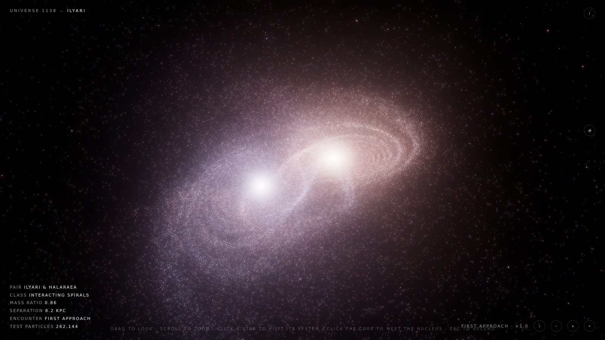

Otherwise: a quarter-million stars seeded from the node you clicked: exponential disk,
Hernquist bulge, globular halo, and logarithmic **density-wave arms** traced
by hot young blue stars and Hα/OIII star-forming nebulae — a handful of
them **volumetric**: bounding spheres whose fragments raymarch emission
through 3D noise density, clouds with real depth and parallax — with dust lanes
that genuinely absorb the starlight behind them (reverse-subtract blending).
Rotation is differential — a flat rotation curve, the dark-matter signature —
computed live in the shader. Spirals, barred spirals, ellipticals and
irregulars all occur. Click any star; or click the core.

### 3 · Star system
The star's mass draws its temperature, luminosity and blackbody color from
main-sequence scaling relations. A few percent of systems orbit a **pulsar**
— a neutron-star corpse sweeping lighthouse beams off its misaligned
magnetic poles inside the filament shell of its own supernova, with
second-generation rocky worlds like PSR B1257+12's (the first exoplanets
ever found). Back in the galaxy view, supernovae pop off stochastically —
watch long enough and you'll catch one. (Otherwise: occasionally a red
giant or white dwarf —
and about one system in five is a **close binary**: two suns waltzing about
their barycenter on true Kepler orbits, with every planet circumbinary
beyond the ~3.5-separation stability limit, Kepler-16 style). Planets obey
**Kepler**: periods from `P² = a³/M★`, positions from solving
`M = E − e·sin E` by Newton iteration every frame. Seven species of world —
barren, terrestrial, ocean, ice, lava, gas giant, ice giant — with procedural
simplex-noise surfaces, drifting cloud decks, sun-lit atmospheric rims,
ringed giants with shadowed ringlets, moons, asteroid belts in the widest
orbital gap, and the occasional long-period comet growing its tail near
perihelion. Some temperate worlds are inhabited; look at their night side.
Orbital radii are gently compressed (r^0.62) so worlds stay visible — the
info cards report the true numbers.

And press **J**: the ship runs **relativistic**. The galactic sky obeys
special relativity star by star, computed in the vertex shader — exact
aberration `cosθ' = (cosθ+β)/(1+βcosθ)` crowds the stars ahead, the Doppler
factor `δ = 1/(γ(1−βcosθ'))` walks each star's blackbody color along a
temperature ramp (blue-white ahead, embers behind), intensity beams as δ³
(the headlight effect), and the system's clocks visibly outrun yours by γ —
throttle to 0.985c and watch a year pass in your minute. Every formula is
the real one — and it is now real **transportation**: steer the bow onto
any star ahead and it locks as a destination with a name, a spectral class,
and a light-year distance; hold your heading and you close the gap and
*arrive* — still moving. You streak into the new system on your old flight
vector, bleed off the last of the β while its worlds resolve around you, and
only then does the helm come back. The galaxy is a place you can cross.

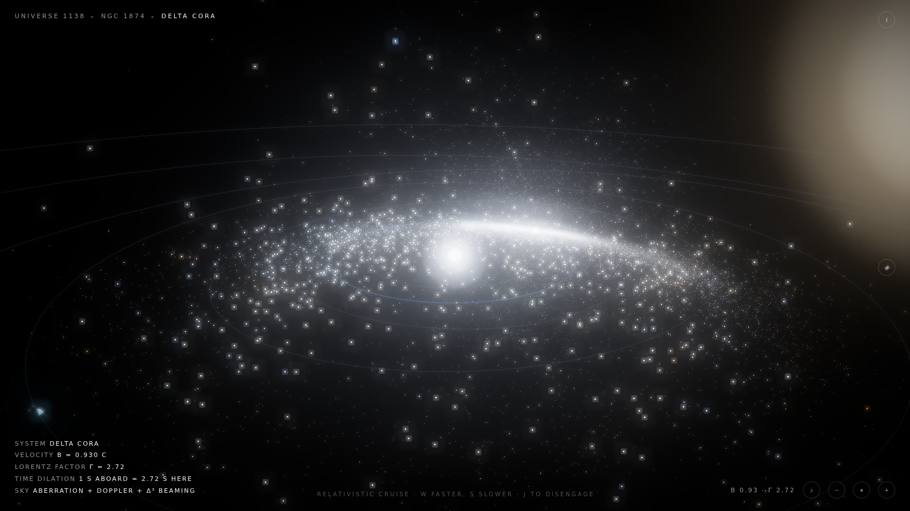

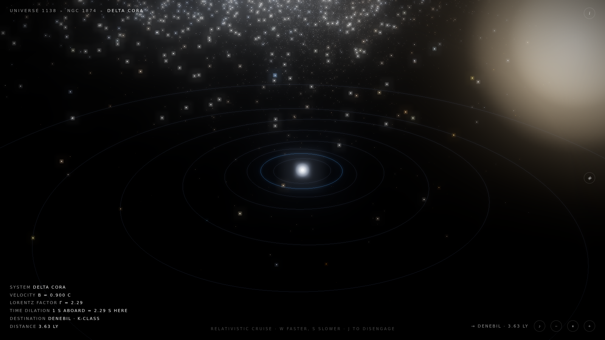

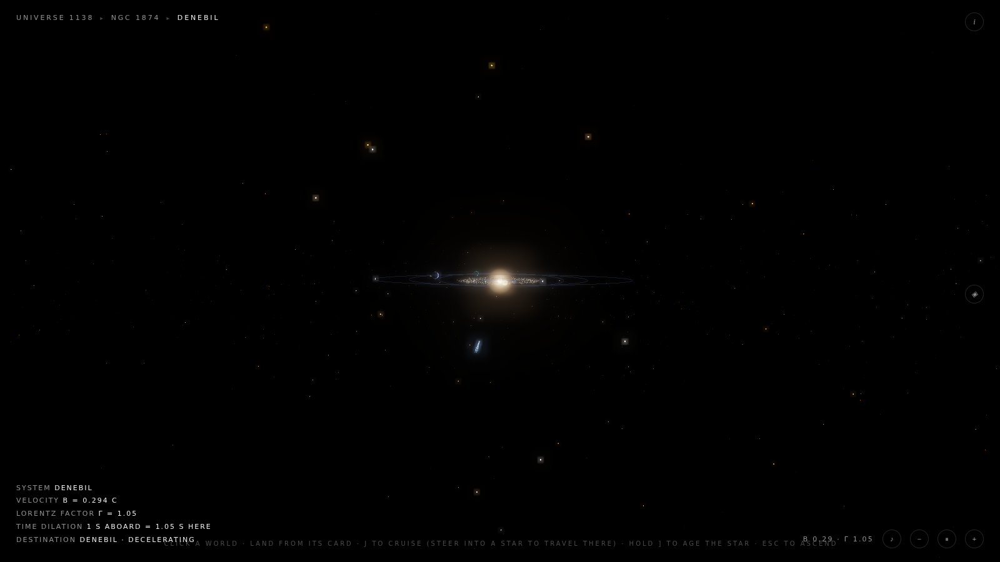

And hold **]**: **deep time**. The star's whole life rides a lever — real
scaling tracks (`t_MS = 10·M^−2.5 Gyr`), the slow main-sequence brightening,
the red-giant ascent with its radius honest from the Stefan–Boltzmann law
until it swallows the inner worlds, then a planetary nebula and the long
white-dwarf cooling — or, past 8 M☉, a live supernova that leaves the
pulsar spinning in its own remnant. Every planet answers to the changing
luminosity: the green habitable-zone band migrates outward across the
system, oceans boil off the old garden worlds and their city lights go
out, while frozen moons thaw into late seas. `[` rewinds; the lever
forgives, though the universe would not.

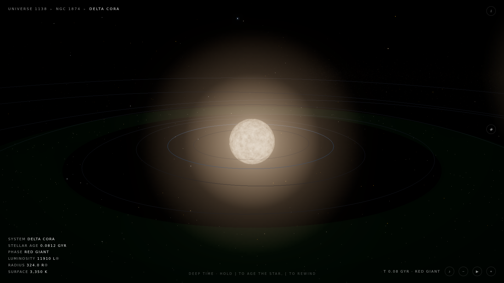

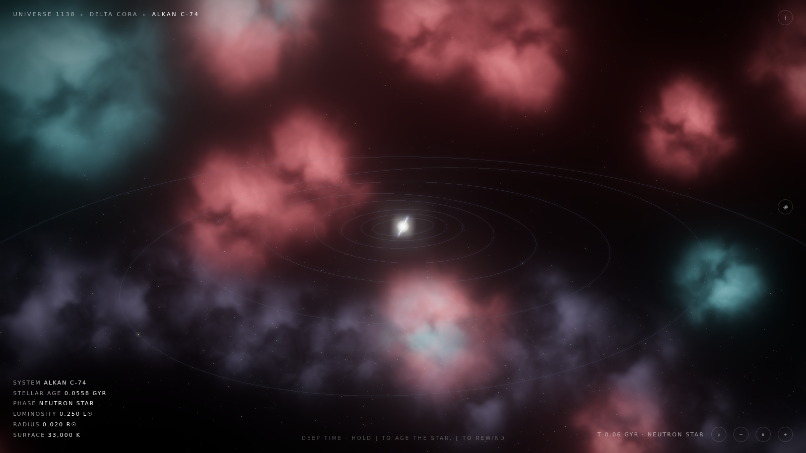

### 4 · The planet, whole — orbit to boots, one continuous scale
Choose **descend from orbit** and the planet stops being a textured ball.
It becomes a **chunked-LOD quadtree** on a tangent-warped cube sphere: six
root tiles that split in four wherever the view demands more, meshed in a
**Web Worker pool** from one height field — the exact macro continents the
orbital shader paints, plus kilometre and metre relief bands — shared
verbatim with the collision code. A parent tile keeps drawing until all
four children have streamed in, and **geomorphing** lerps every vertex
(and its normal) toward its parent-grid shape by view distance, so a
child spawns wearing its parent's exact geometry and refines as you
close: LOD transitions carry zero pop, no cuts, no fades.

You don't have to fly it yourself: from the moment you arrive, **the
autopilot has the ship**. A descent director picks a landing site —
sunlit, dry ground, biased toward high relief and, on inhabited worlds,
toward the city-lights glow — and flies the whole fall for you: a
great-circle glide out of orbit, through the volumetric cloud deck
mid-way, into a long terrain-following low glide with the camera easing
from looking down at a world to looking out at a country, then a flare,
and **touchdown, walking**, about 44 seconds after you pressed the
button. Drag to look around freely the whole way down — the ship keeps
flying — or touch any key and the helm is instantly yours.

The trip home is flown too: **Esc near the ground engages the ascent
director** — a slow liftoff steepening into the burn, the nose easing up
and then rolling over to watch the world shrink, handing off seamlessly
to the system view at apex. Esc again skips ahead; any key keeps you
on-world with the helm. And from the system view, every landable world's
card offers **fly there · autopilot**: the ship glides the transfer
across the system and hands the fall to the descent director. With both
directors, grass on world A to grass on world B is Esc and one button.

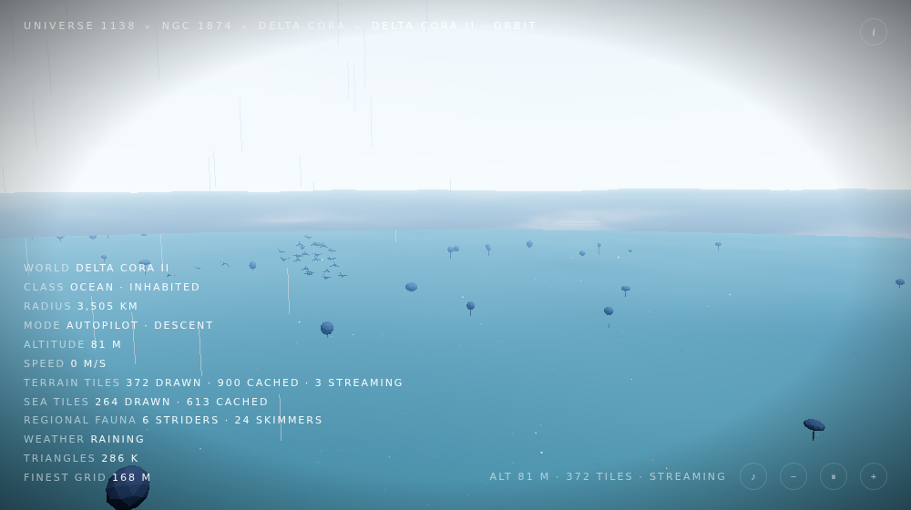

Fly manually with **WASD** and **R/F** — *your speed is your altitude*,
thousands of km/s at apoapsis — and just keep descending: under two
eye-heights the scale sets you down and **you are walking**, boots held
to the same field the tiles are meshed from (measured ground-glue error:
0.000 m), the camera near plane riding your altitude from centimetres to
orbit. **R** lifts off again.

And the world is *inhabited in place* now. Under eight units of altitude
a **biome anchor** appears at the ground point — a local east/up/north
frame speaking the exact host contract the old close-up surface spoke —
and the tufts, alien trees, boid skimmers, antiphase striders, and night
spores spawn onto the globe itself. Settlements rise **exactly where the
night-lights shader glows from orbit** (the same fbm mask gates both):
land on a glow, find the towers. Airless worlds carry their bombardment
in the height field — dozens of ancient bowl-and-rim scars at every LOD —
and **X** calls down a live meteor whose crater joins the shared field on
impact (verified: the ground at the strike point drops 45 m and six
tiles restream). The classic surface scale is retired for planets; old
`?p=` links follow you onto the globe.

And where the glow burns hardest, the towers become a **metropolis with
a name**. Every inhabited world quantizes its sphere into cells, and any
cell whose night-lights fbm peaks hard enough over dry ground grows a
full deterministic city (`src/city.js`): an island-shaped ellipse of
true street grid — avenues along the long axis, cross streets every
eighty-odd metres, one diagonal boulevard cutting the whole plan — with
**two districted skyline cores** falling away from glass supertalls
through warm masonry midrise to brick sprawl at the frayed edge, a
central park mid-island, pocket parks dotting the grid, and a plaza kept
clear near downtown. The ground itself cooperates: each city **grades
its terrain into the shared height field** (the crater mechanism's civil
twin — workers, collision, paint and streets all read the same graded
crust, and a meteor can still scar downtown because scars apply after
grading). Where an avenue meets water it can cross, it crosses: a decked
span with towers, catenary main cables, and a **necklace of lights after
dark**; where it can't, it ends in a pier — and the piers put **ferries
on the harbor**, dragging wakes between the marks. Traffic works the
grid the whole time — hundreds of instanced vehicles, taxi-yellow at
honest concentration, reading as paired headlight-white and
taillight-red streams down the canyons at night — street lamps come up
sodium-warm, the tallest roofs blink their aircraft warnings, and the
windows **ignite one by one as the dusk deepens**, each keeping its own
hour. Cities stream in like terrain tiles (a budgeted generator builds
the blocks across frames, finished long before you're close enough to
tell) and the whole thing is brutal-instancing-discipline cheap: one
draw call for every building, one for every car, one for every lamp —
about fifteen for a city of thousands of pieces. The descent director is
in on it: on inhabited worlds the autopilot **lands you on the plaza
downtown**, the HUD names the city, counts its population, vehicles,
ferries and bridges, and the hamlet settlements stand down inside metro
limits. Deterministic like everything else — universe 5's Velthal, pop
8.1 M, is the same Velthal on every machine, forever. `?ct=0` keeps the
countryside.

The land itself drains — and now it drains *correctly*: a *real global
flow solve* (priority-flood depression filling seeded from the sea, D8
steepest-descent accumulation on a cube grid, ~1 s baked per world)
produces **watershed corridors that provably reach the ocean**, and the
fine fbm meanders live only inside them, their width and depth following
the accumulated flow. Valley floors damp into alluvium; the fragment
shader lays a specular water ribbon in every bed; tributaries join
trunks and trunks find the sea, filling the occasional inland basin into
a lake on the way. The terrain itself now **remembers the water**: trunk
corridors carve broad swales (a hundred metres deep at full flow — the
more upstream area, the wider the valley reads from the air, and the
greener), and where a trunk crosses the shoreline its discharge splats
into the receiving water cells and the mesher deposits a **braided
delta** — a fan whose bars breach the sea surface where the braid noise
runs high, wearing wet sand in the shader, laced with shallows. All of
it formula-exact between worker, collision, and paint. Continental
worlds grow real deltas; ocean worlds, honestly, barely gather a river.

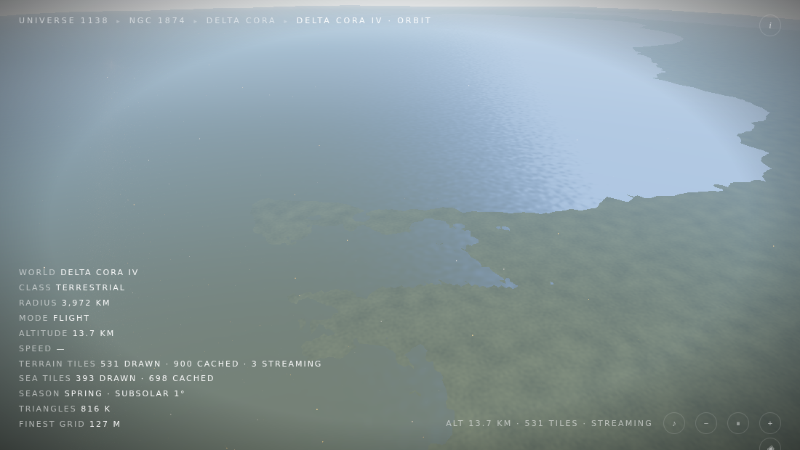

And the sky above answers: the volumetric deck's own density field,
sampled at your zenith, decides the **weather** — rain streaks or
drifting snow under the overcast, a wetness that slicks and darkens the
ground for a while after the sky clears. The wind advects the whole
field on a watchable timescale, so **fronts arrive and leave** while you
stand there; the densest cells are **thunderstorms** — lightning
double-strikes inside the deck and throws a point light across the wet
ground — and the painted rivers **swell while the ground is wet**, a
live discharge multiplier widening every ribbon up to 1.8×. The HUD
calls it: fair, raining, thunderstorm, blizzard.

Every world **leans**, too. An axial tilt (up to ~29°) makes the sun's
declination ride the orbital phase, so the time lever is planetary now —
hold `.` and watch winter come. The **snow line migrates** hemisphere by
hemisphere (the cap-line term keys on the live subsolar latitude — the
shader needs no extra uniform), temperate worlds trade rain for snow in
local winter, and the HUD names the season under your feet.

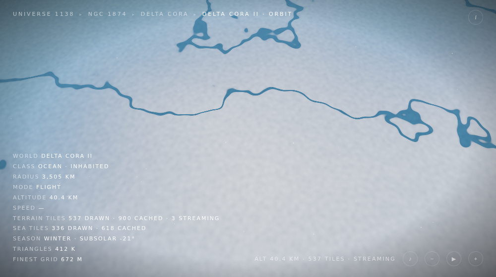
And the fauna is an **ecology** now: the sphere is quantized into
regions, each with a persisted population (localStorage) that grows
logistically between your visits; flora density follows regional
richness, striders bolt when you close within 55 m — sliding along
shores instead of aiming into the sea — skimmer flocks give you a wide
berth, and a meteor strike scatters everything. The HUD shows the
regional census.

Overhead, on inhabited worlds, there is a **second civilization of
scale**: stations on inclined orbits (truss, habitat ring, panel wings)
and ships flying errands between stations, launch corridors, and deep
space — and the ports keep daylight hours, concentrating launches on the
lit side of the world. Every hull's sprite follows the true sunlit test
against the planet's shadow cylinder — from the grass at night they are
moving lights among the stars that redden and vanish into eclipse
mid-pass. And you can go with them: press **B** on the ground and a
shuttle rides you up the corridor arc, ~46 seconds of your planet
falling away under free look — and docking steps you through the
airlock onto the **ring deck**: a walkable catwalk inside the habitat
torus, floor plates, ribs, and handrails at true scale, where the hull
culls itself from within so the whole sky — your planet, the stars, the
traffic — **wheels past as the station spins**. W/S walk the deck, A/D
cross it, B steps back off with the helm in your hands.

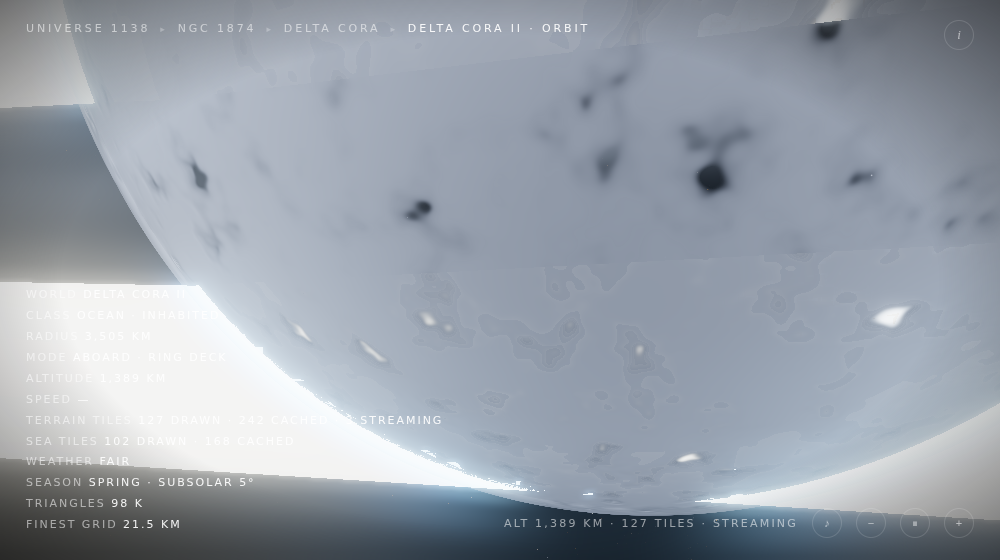

The
cloud deck they descend through is **volumetric**: a raymarched slab
with fbm density, wind drift, and two-tap sun transmittance — fall
through it and the world whites out and returns (`?vc=0` keeps the old
shell; `?vs=` tunes the march).

Worlds with seas carry a second quadtree wearing **water**: Schlick
Fresnel against the sky, analytic wave trains plus noise breakup, sun
glint, depth-tinted color from the true bathymetry — and near the camera
the primary swell is **true Gerstner geometry**, crests sharpening and
silhouettes actually moving. The sky is *computed*: a **Rayleigh + Mie
raymarch** fed by a CPU-precomputed transmittance table and **Hillaire's
multiple-scattering factor Ψ(h, μs)** — noon is blue because the math
says so, the terminator burns red, and after sunset the sky holds a real
luminous twilight (Ψ stays nonzero with the sun 10° below the horizon)
while the stars fade up through the actual transmittance.

Precision is the quiet trick under all of it. float32 runs out five
digits before a planet reaches walking distance, so vertices are stored
relative to their tile's center (built in float64 in the worker), the
camera never leaves the scene origin, and the planet carries the negative
camera position in JavaScript doubles — the GPU only ever sees the small
difference. Standing on the rocks, nothing jitters.

`?pl=<index>` deep-links an approach; `?quad=0` restores the direct
landing; `?qk=` trades tile budget for fidelity; `?atm=0`, `?gm=0` toggle
the sky and the morphing.

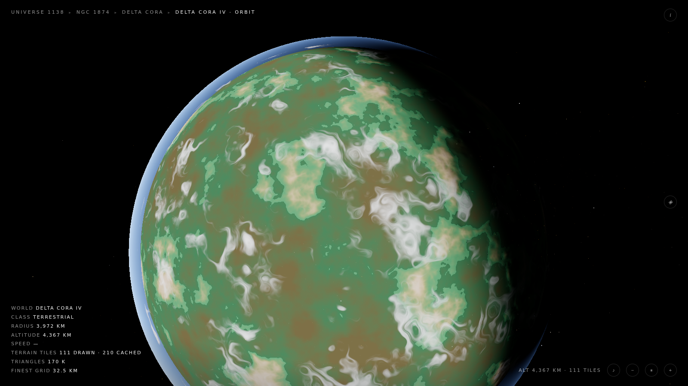

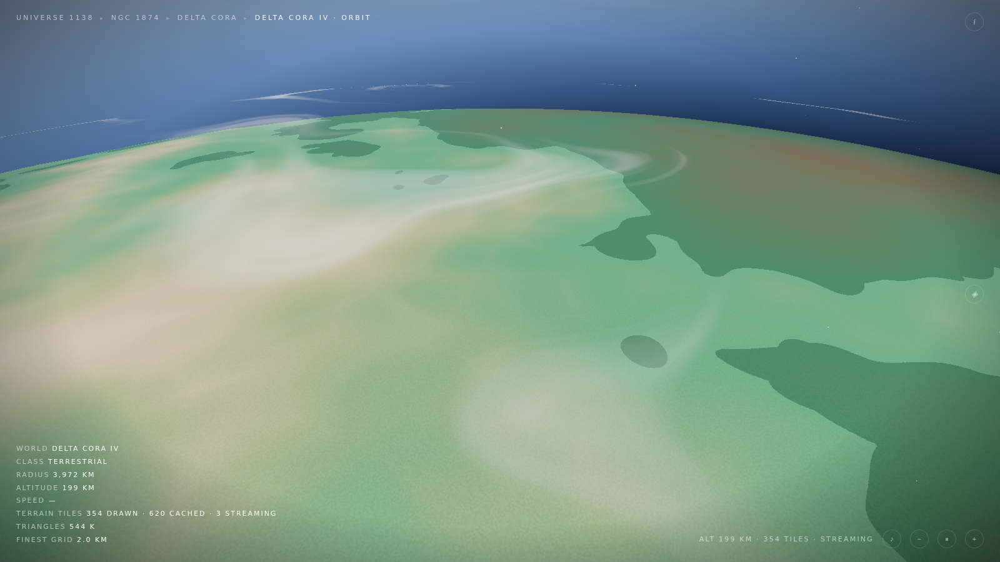

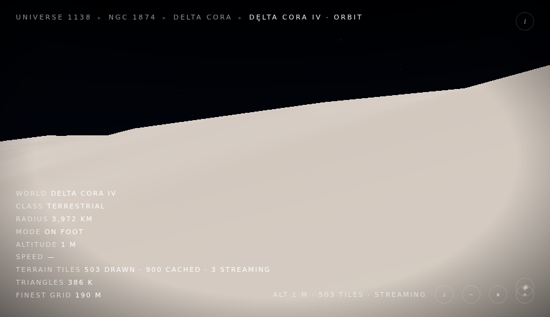

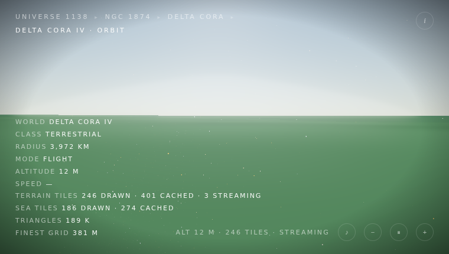

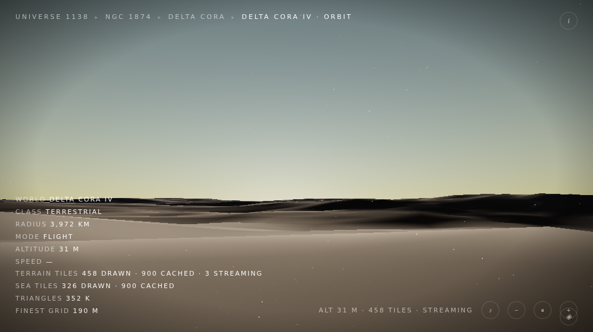

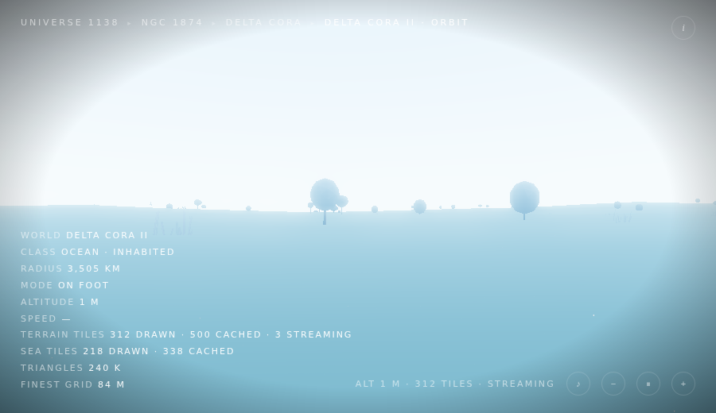

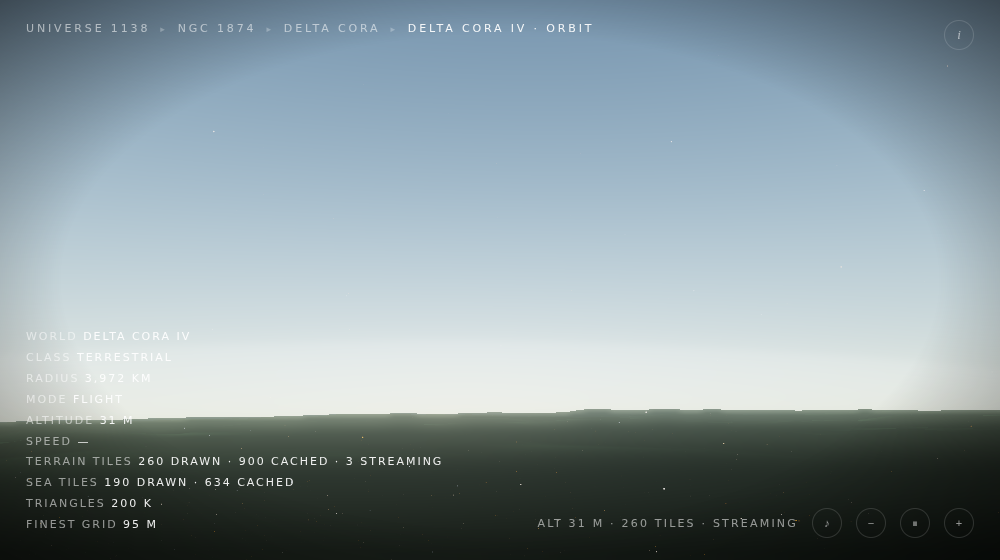

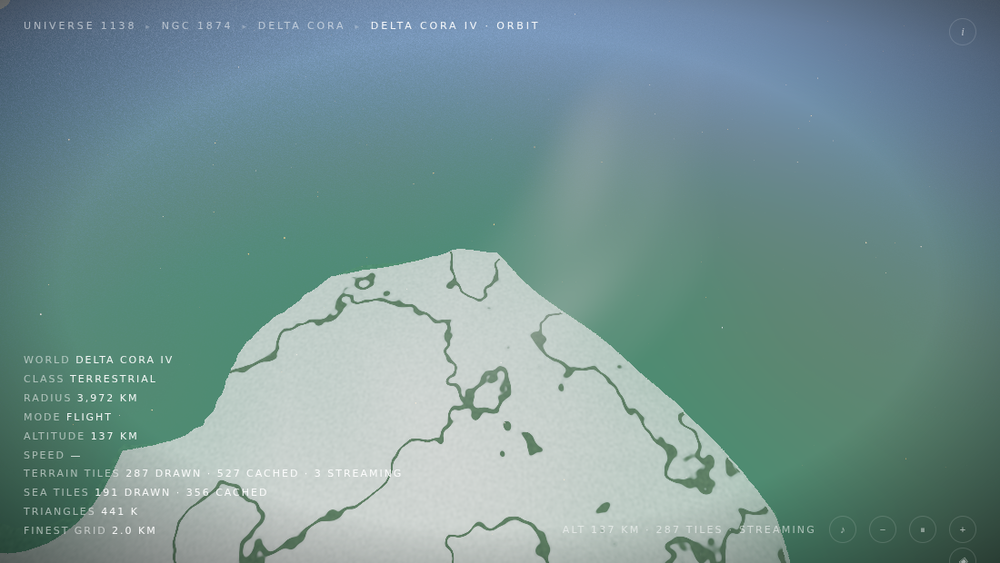

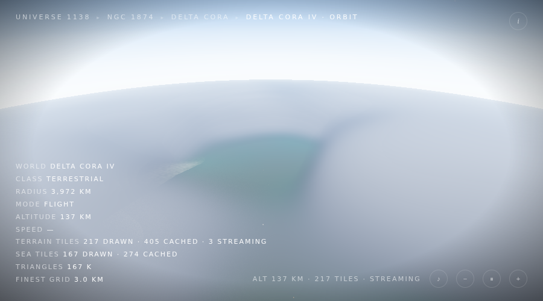

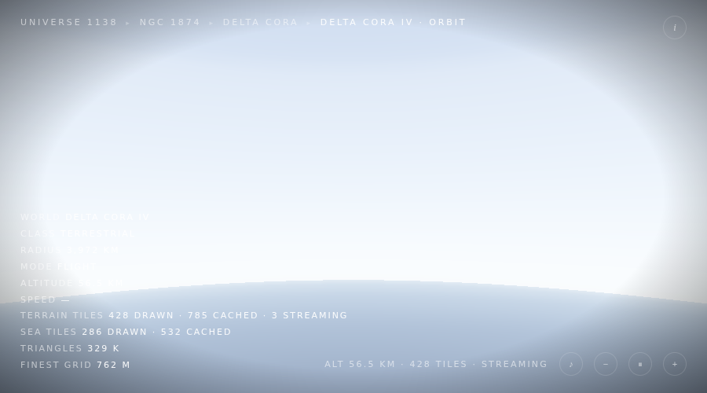

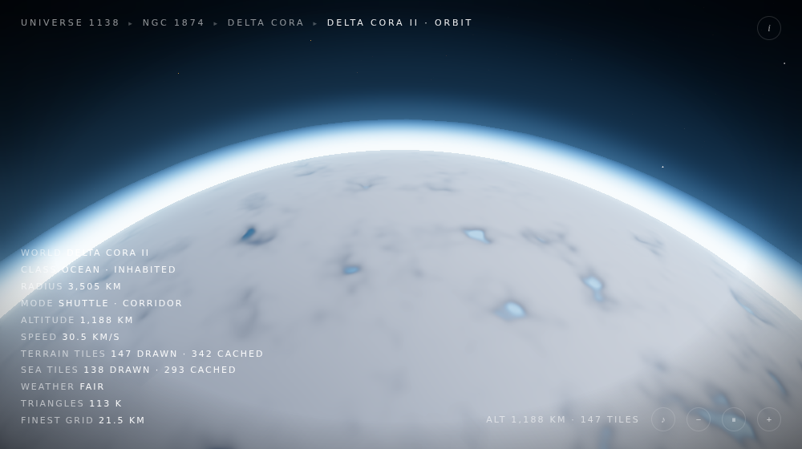

### 5 · The surface — set foot on it
Every solid world — **and every moon** — can be landed on from its info
card, and the descent is **continuous**: the same Ashima simplex noise the
orbital shader draws is ported exactly to JavaScript (`src/terrain.js`), so
the ground is a sample of the planet's true height field — the landing
site is chosen metres above the real waterline, and the coast you walk is
the coast you saw from space. Three LOD rings carry the terrain ~14 km to
a horizon that curves with the world's actual radius, and the scale swap
hides inside an atmospheric veil on the way down. Comets near perihelion
hang in the twilight with their tails combed anti-sunward.

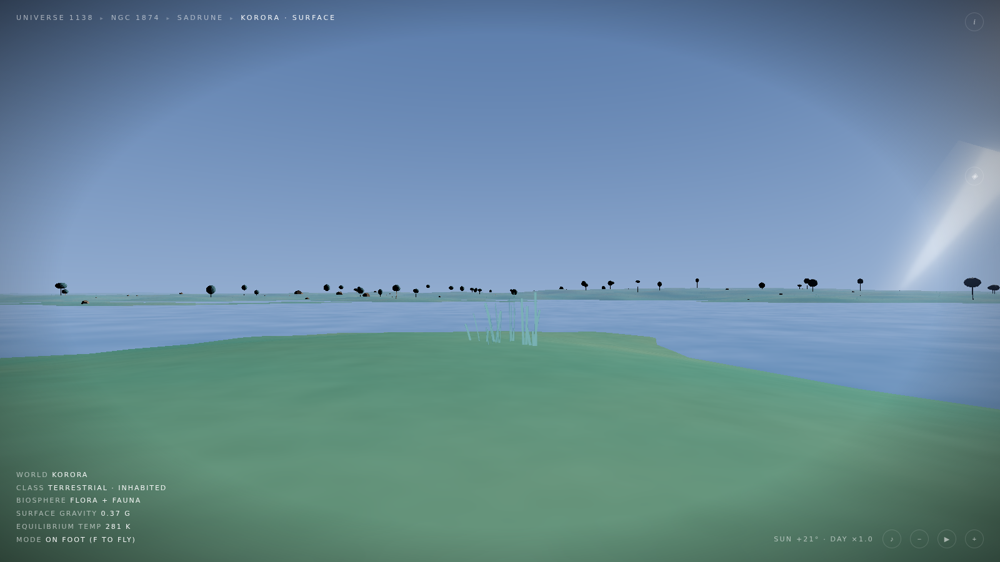

The sky's sun is the system's actual star — correct blackbody color,
correct angular size for this orbit. Walk with WASD (drag to look, Shift to run, `F` to fly), watch
the day turn, and on inhabited worlds wait for dusk: city glow rises over
the ridgeline. Ocean worlds put you on an island shore; lava worlds seep
light through fissures at night. Stand on the moon of a ringed giant and
the parent world hangs vast and tidally fixed overhead, rendered by its
real orbital shader and lit by the local sun — it runs through true phases
as the day passes. The sibling planets wander the sun's arc at their true
elongations. The HUD reports true surface gravity, GM/R². And the sky is not always
kind — press **X** (or just wait) and a meteor streaks down, flashes on
impact, and leaves a bowl-and-rim **crater** baked permanently into the
terrain's height field, ringed with scorched ejecta. Airless worlds arrive
already pockmarked with ancient ones.

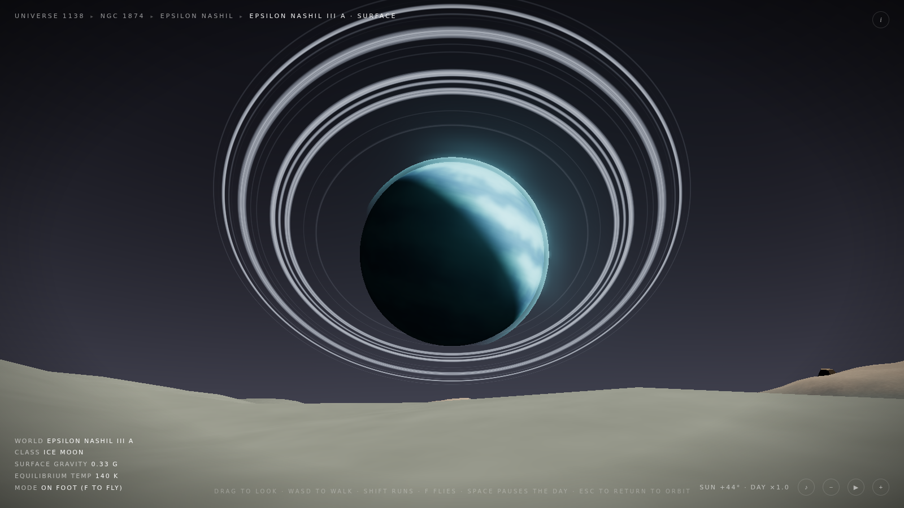

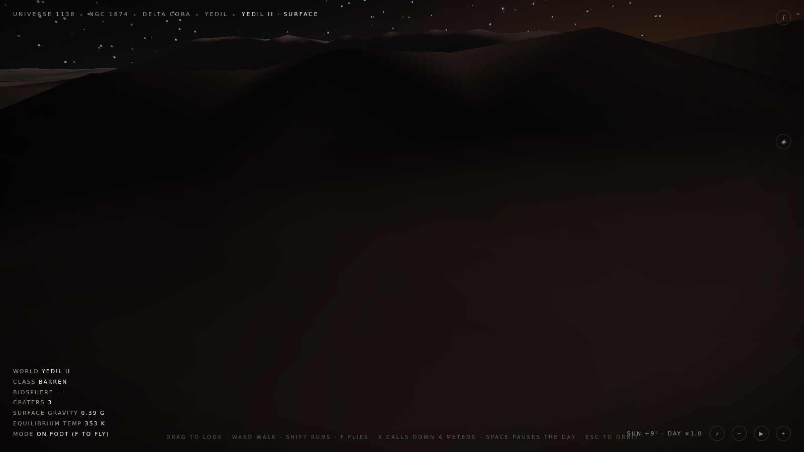

Worlds in the liquid-water band grow a **biosphere**: alien flora in a
palette seeded by the world itself, winged skimmers that beat and bank
through boid flocks (flap computed in the vertex shader), tall two-legged
striders grazing the hills with a true antiphase gait, and — after dark on
inhabited worlds — drifting bioluminescent spores. Inhabited worlds keep a
**settlement** near the landing site: towers whose procedurally-drawn
windows light one by one with the dusk, beacon masts blinking at the edge
of town. Your own moons cross the sky with true phases.

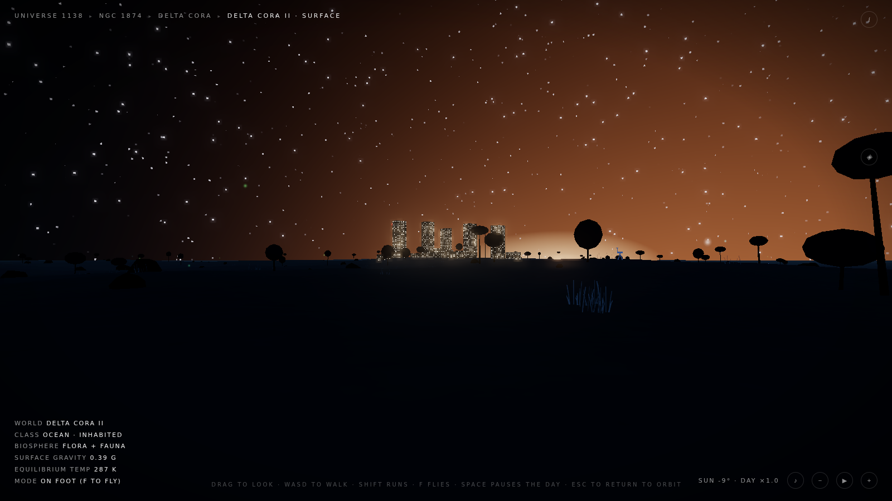

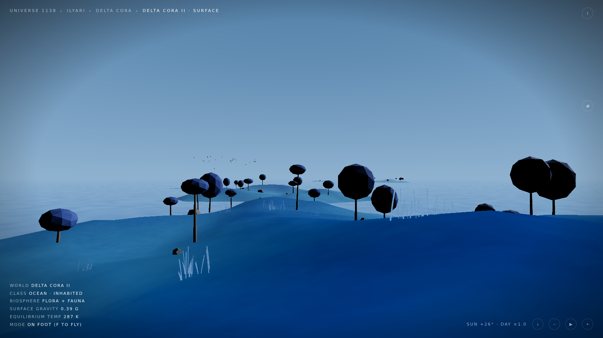

Gas and ice giants have no surface to land on — so **dive the cloud deck**
instead: cruise between infinite procedural stratus layers in the planet's
own palette, steer into cumulus towers, and watch lightning go off below
the deck, as it does on Jupiter.

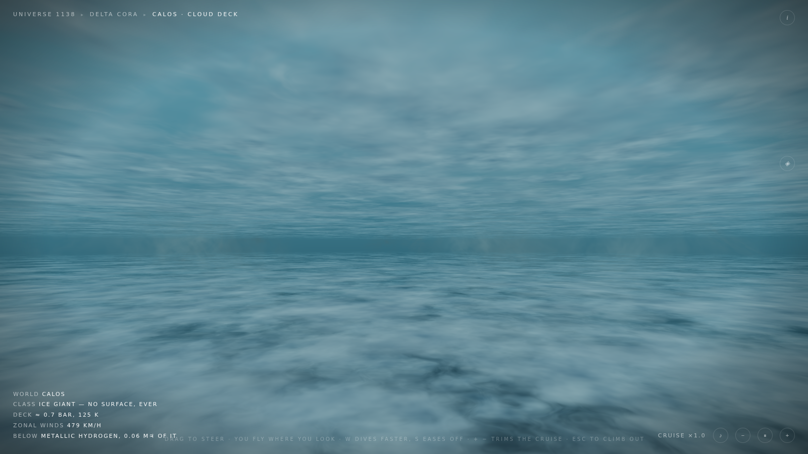

### 6 · The nucleus — a black hole, computed honestly
Every pixel's ray is integrated through Schwarzschild spacetime
(`d²x/dλ² = −(3/2)h²x/r⁵`, the exact null-geodesic equation, 170 steps per
pixel). The photon ring, the accretion disk arching over and under the
shadow, the doubled disk images, the lensed starfield — none of it is
painted; all of it falls out of the integration. Disk emission is
Doppler-boosted by δ³, so the approaching side burns brighter and bluer,
as the Event Horizon Telescope observed at M87*.

## Design

- **One continuous universe**: the system's night sky is not a texture — it
  is *your* galaxy, all 240k stars projected with 1/d² brightness from your
  star's true seat in the disk (dive near the core and the sky burns);
  behind every galaxy, the actual cosmic-web neighborhood it condensed
  from glimmers at infinity.
- **It sounds like it looks**: a generative WebAudio score with zero
  samples — a beating two-tone void in the web, starlight shimmer in
  galaxies, breathing subs at the horizon of the black hole, and wind
  shaped by each world's actual atmosphere. Risers accompany every
  hyperzoom. `M` mutes.
- **OLED-first**: everything luminous over true black; HDR half-float
  pipeline with selective bloom; hairline typographic HUD that fades away.
- **Non-deterministic universe, deterministic worlds**: every visit rolls a
  fresh seed, so no two arrivals are the same cosmos — but within a seed,
  every galaxy, star, planet, name and civilization is a pure function of
  `hash(seed, …)`. Universe 1138's Delta Cora is the same Delta Cora on
  every machine, forever; the URL always carries your seed, so the universe
  you rolled is yours to share. `U` rolls another.
- **A logbook** (`B`, or the ◈ button — on a planet `B` belongs to the
  shuttle, use the button): mark any place — a cloud deck, a moon, a
  colliding pair — and warp back to it later. Entries are just the same
  shareable coordinates the URL always carries, across universes.
- **A tour mode** (`T`): AEON flies itself — creation plays out, a node is
  chosen, the camera falls through a galaxy to a star, lands somewhere or
  sinks into a cloud deck, visits the black hole, and begins again
  somewhere new. Touch anything to take the controls.

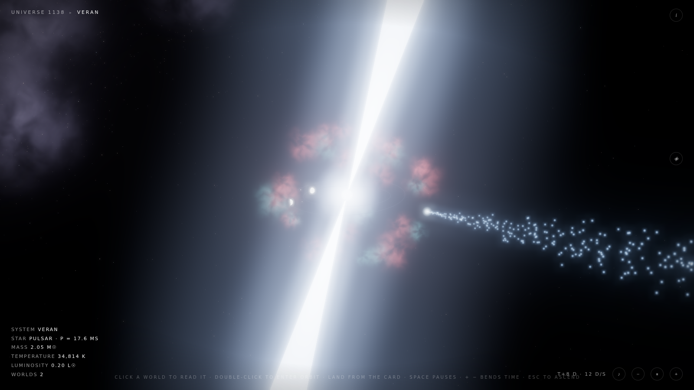
- **Enormous**: ~314k web tracers × any node → a galaxy of 240k clickable
  stars → ~10²⁸ addressable star systems per universe × 2³² universes.
- **Zero dependencies** beyond a vendored Three.js r170; runs from any
  static file server.
- **Adaptive**: resolution scales itself to hold frame rate.

## Files

```
index.html          shell, import map, HUD styling
src/main.js         scale stack, input, deep links, logbook, adaptive quality
src/transition.js   seamless hyperzoom dives between scales
src/cosmology.js    ΛCDM: growth factor D(a), cosmic age t(a)
src/cosmic.js       the cosmic web: N-body + Zel'dovich fallback
src/nbody.js        GPU particle-mesh N-body: FFT Poisson solver, leapfrog
src/galaxy.js       procedural galaxies, supernovae, volumetric nebulas
src/collision.js    interacting galaxy pairs: restricted three-body tides
src/system.js       Keplerian systems, binaries, pulsars, deep time
src/planet.js       GLSL worlds: surfaces, clouds, atmospheres, rings, star
src/planetscale.js  the whole globe: streaming quadtree descent
src/quadtree.js     chunked-LOD cube-sphere: split/merge, LRU, streaming
src/tilebuild.js    tile mesher — main-thread roots + Web Worker pool
src/terrain.js      exact JS port of the GLSL height field
src/surface.js      walkable surfaces: LOD rings, craters, moons in the sky
src/clouds.js       gas-giant cloud-deck cruise
src/life.js         procedural creatures with gaits
src/settlement.js   towers and beacons on inhabited worlds
src/city.js         the metropolis: street grids, districted skylines,
                    bridges, harbors, traffic, and dusk igniting the windows
src/blackhole.js    Schwarzschild geodesic raymarcher
src/tour.js         the cinematic auto-pilot (T)
src/audio.js        generative ambient beds per scale
src/nebula.js       procedural nebula textures & sprites
src/starfield.js    galaxy-from-within sky, relativistic star shading
src/post.js         HDR bloom pipeline
src/hud.js          the interface
src/rng.js          deterministic hashing, RNG, name synthesis
```

## Gallery

| | |
|---|---|
| 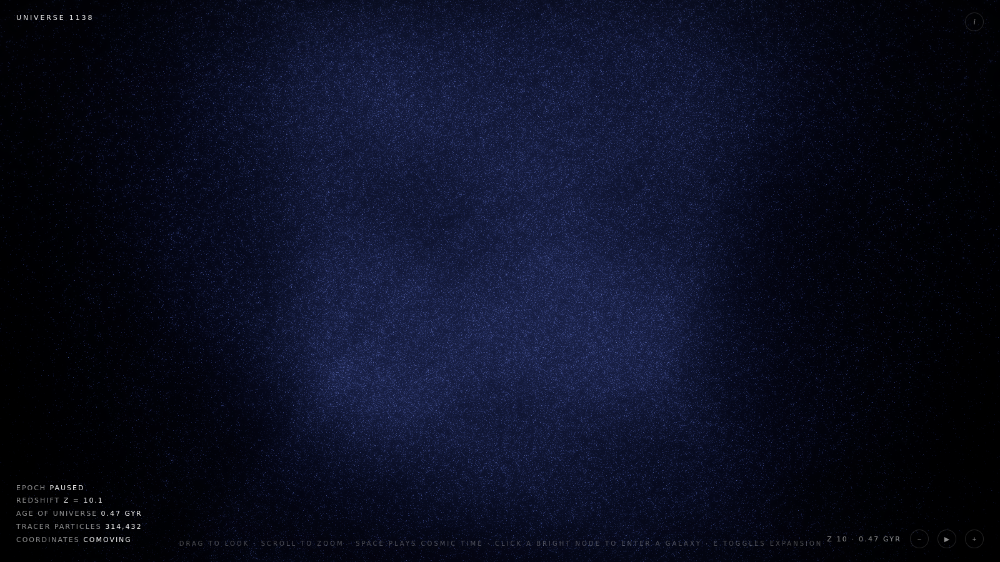 | 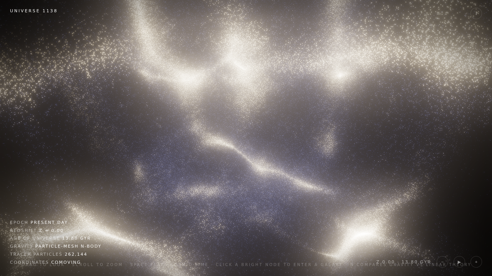 |
| 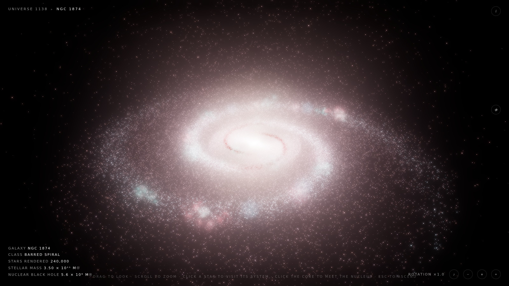 | 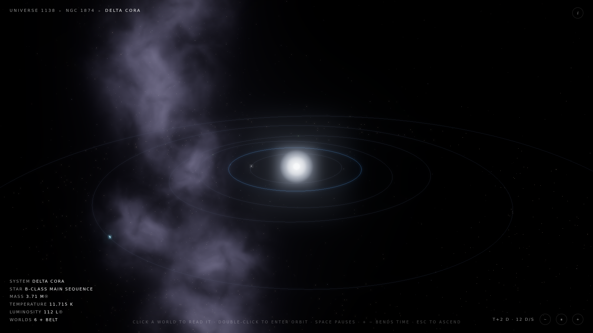 |
| 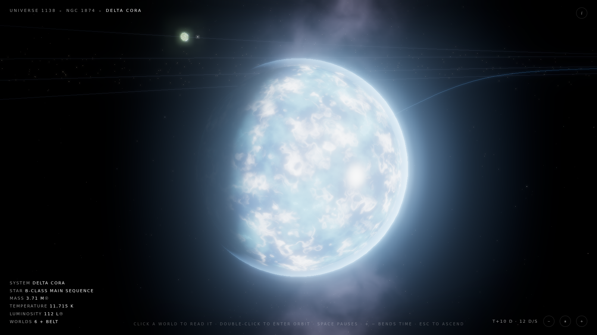 | 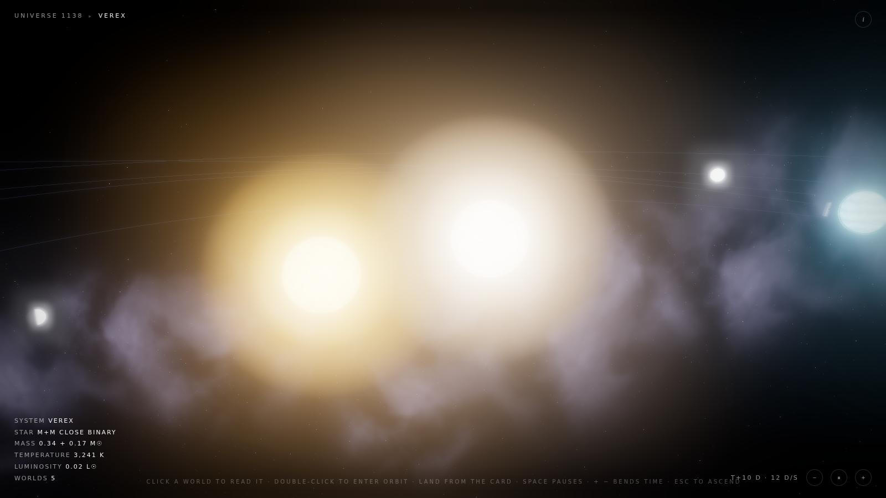 |
| 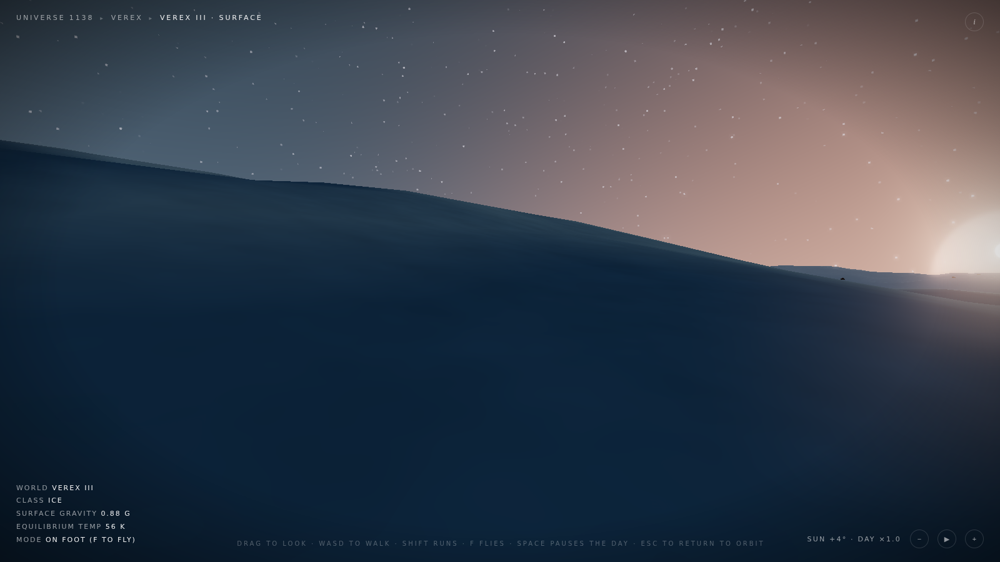 | 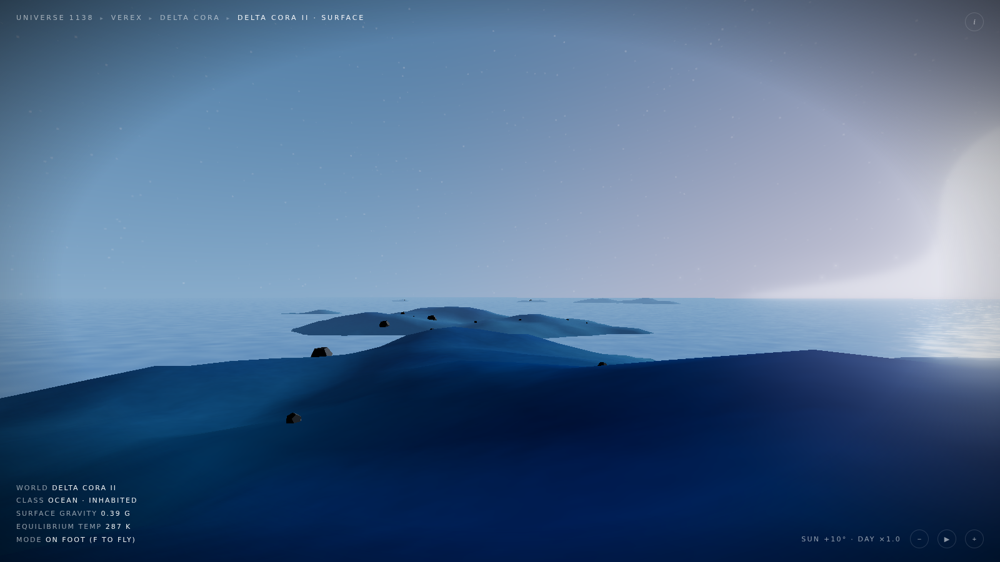 |

City glow after dark on an inhabited ocean world:

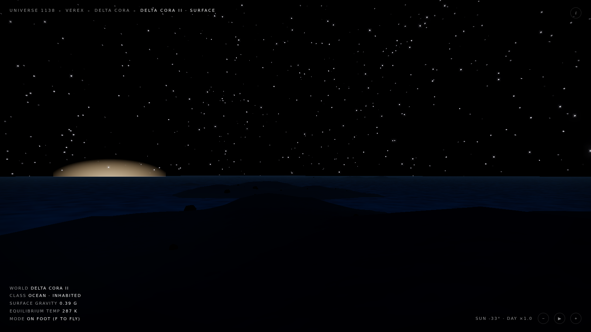

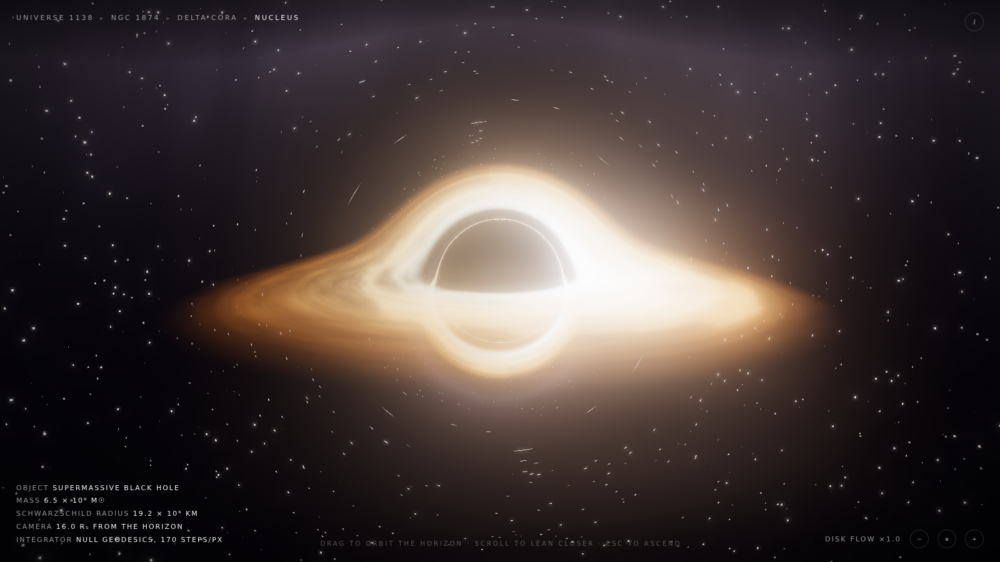
